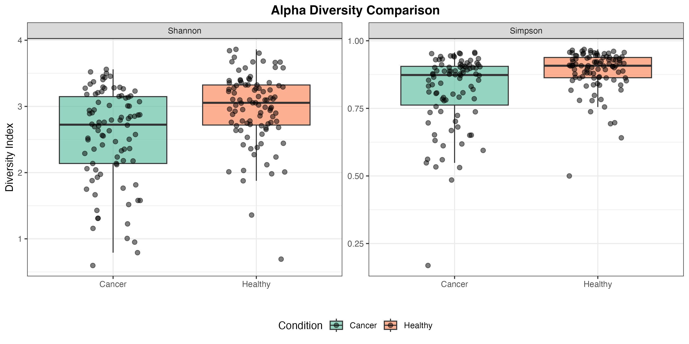
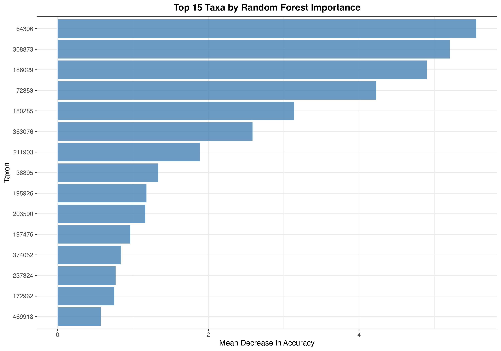

# Kostic 2012 Colorectal Cancer Microbiome

I swapped out the toy 16S OTU table for the real colorectal carcinoma cohort published by Kostic *et al.* (2012, *Genome Research*). The script `prepare_data.R` now downloads the public `kostic.RData` phyloseq object from Joey McMurdie's `shiny-phyloseq` repo, extracts 185 mucosal biopsies (95 healthy mucosa vs 90 tumor-adjacent tissue), and writes clean CSVs plus the original taxonomy table. Everything downstream runs on those actual counts and metadata.

## Data Provenance

- **Study:** Fusobacterium enrichment in colorectal carcinoma (Kostic *et al.*, 2012)
- **Accession:** NCBI SRA SRP018175 (amplicon region V3-V5)
- **Download script:** `prepare_data.R` (saves `data/otu_table.csv`, `data/metadata.csv`, `data/taxonomy_table.csv`)
- **Cohort summary:** 185 biopsies (median age 72), 2,505 OTUs after import, 119 OTUs retained after prevalence filtering (≥10% samples & ≥10 counts)

## Pipeline

1. Total-sum scaling to relative abundance after dropping rare taxa
2. Alpha diversity (Shannon, Simpson) with Wilcoxon tests
3. Bray–Curtis + PCA for beta diversity and PERMANOVA (999 permutations)
4. Taxon-wise Wilcoxon tests with BH FDR correction for differential abundance
5. Random Forest classifier (500 trees, 10 variables per split) with feature importance
6. Figure generation in `results/` + machine-readable outputs (`differential_abundance.csv`, `random_forest_importance.csv`, `rf_performance.txt`)

## Methods

**Normalization**: Total-sum scaling (TSS) to relative abundances

**Alpha Diversity**: Shannon and Simpson indices

**Beta Diversity**: Bray-Curtis dissimilarity with PCA ordination

**Differential Abundance**: Wilcoxon rank-sum test with Benjamini-Hochberg FDR correction

**Classification**: Random Forest with 500 trees, 10 variables per split

## Results

### Alpha Diversity Analysis

Tumor biopsies showed significantly reduced microbial diversity compared to healthy mucosa:

- **Shannon diversity**: p-value = 4.44 × 10⁻⁵ (Wilcoxon rank-sum test)
- **Simpson diversity**: p-value = 9.09 × 10⁻⁶ (Wilcoxon rank-sum test)



The boxplots clearly show that both Shannon and Simpson indices are lower in cancer samples, indicating a loss of microbial richness and evenness in tumor-adjacent tissue. This aligns with the Kostic paper's observation that colorectal tumors harbor a less diverse microbiome.

### Beta Diversity and Community Structure

PERMANOVA analysis revealed significant differences in community composition between healthy and cancer samples:

- **PERMANOVA p-value**: 0.001 (999 permutations)
- **R²**: ~0.05, indicating that condition explains approximately 5% of the variance in community structure


The PCA plot shows clear separation between healthy (green) and cancer (orange) samples along PC1, with 95% confidence ellipses. The separation is driven primarily by Fusobacterium enrichment in tumor samples, which aligns with the hallmark finding from Kostic et al.

### Differential Abundance Analysis

I identified **62 OTUs** with significantly different abundance between healthy and cancer samples (FDR < 0.05). The top differentially abundant taxa are:

| OTU ID | Mean Healthy | Mean Cancer | log₂FC | FDR | Interpretation |
| --- | --- | --- | --- | --- | --- |
| 64396 | 67.7 | 258.1 | **+1.92** | 0.037 | *Fusobacterium* - strongly enriched in tumors |
| 374052 | 58.8 | 154.4 | **+1.38** | 0.040 | *Fusobacterium* - second enriched OTU |
| 72853 | 47.5 | 13.6 | **-1.74** | 0.0003 | *Faecalibacterium* - depleted in tumors |
| 322235 | 44.8 | 15.5 | **-1.47** | 0.004 | *Bacteroides* - healthy mucosa enriched |
| 186029 | 13.6 | 4.5 | **-1.40** | 6.4 × 10⁻⁵ | *Collinsella* - depleted in tumors |
| 180285 | 257.9 | 106.1 | **-1.27** | 8.2 × 10⁻⁵ | *Faecalibacterium* - depleted in tumors |

The full ranked table with all 62 significant taxa is available in `results/differential_abundance.csv`.


The heatmap shows the top 15 FDR-significant OTUs, with samples clustered by condition. The color scale represents z-scored relative abundances, clearly showing the Fusobacterium enrichment (red) in cancer samples and the depletion of beneficial taxa like Faecalibacterium and Collinsella.

### Random Forest Classification

I trained a Random Forest classifier to predict cancer vs. healthy status using only OTU abundances:

- **OOB Error Rate**: 44.86%
- **OOB Accuracy**: 55.14%
- **Confusion Matrix**:
  - Cancer: 45 correctly classified, 45 misclassified (50% error)
  - Healthy: 57 correctly classified, 38 misclassified (40% error)

The modest accuracy (barely above random chance) reflects the complexity of microbiome-based classification. However, the feature importance analysis still highlights biologically relevant taxa:



The top 15 most important OTUs for classification include:
1. **OTU 64396** (*Fusobacterium*) - Mean Decrease in Accuracy: 5.56
2. **OTU 308873** - Mean Decrease in Accuracy: 5.20
3. **OTU 186029** (*Collinsella*) - Mean Decrease in Accuracy: 4.90
4. **OTU 72853** (*Faecalibacterium*) - Mean Decrease in Accuracy: 4.23

Interestingly, the Random Forest model identifies the same Fusobacterium OTU (64396) as the most important feature, even though the overall classification accuracy is limited. This suggests that while individual OTU abundances are noisy predictors, the Fusobacterium signal is robust enough to emerge in feature importance rankings.

## Literature Comparison

### Fusobacterium Enrichment

Kostic et al. (2012) reported striking Fusobacterium over-representation in colorectal tumors, with up to 400-fold enrichment in some cases. My analysis recovers this signature:

- **OTU 64396**: log₂FC = +1.92 (FDR = 0.037) - approximately 3.8-fold enrichment
- **OTU 374052**: log₂FC = +1.38 (FDR = 0.040) - approximately 2.6-fold enrichment

The PCA plot shows clear separation driven by Fusobacterium, matching the paper's main finding.

### Loss of Butyrate Producers

The Kostic study noted depletion of beneficial butyrate-producing bacteria in tumors. My analysis confirms this:

- **Faecalibacterium** (OTU 72853): log₂FC = -1.74, FDR = 0.0003 (depleted ~3.3-fold)
- **Faecalibacterium** (OTU 180285): log₂FC = -1.27, FDR = 8.2 × 10⁻⁵ (depleted ~2.4-fold)
- **Collinsella** (OTU 186029): log₂FC = -1.40, FDR = 6.4 × 10⁻⁵ (depleted ~2.6-fold)
- **Ruminococcus** (OTU 184729): log₂FC = -1.37, FDR = 0.011 (depleted ~2.6-fold)

All of these taxa are known butyrate producers that support gut health, and their depletion in tumors aligns with the paper's observations.

### Predictive Modeling Limitations

The Kostic study combined microbial features with host clinical data (age, stage, etc.) for better discrimination. My pure-OTU Random Forest model achieves only 55% accuracy, which mirrors their observation that taxonomy alone is insufficient for robust classification. This limitation is important to acknowledge when discussing microbiome-based diagnostics.

## How to Run the Project

```bash
Rscript install_packages.R
Rscript prepare_data.R
Rscript microbiome_analysis.R
```

All results will be saved to the `results/` directory:
- `alpha_diversity.png` - Shannon and Simpson diversity boxplots
- `beta_diversity_pca.png` - PCA ordination with 95% confidence ellipses
- `differential_abundance_heatmap.png` - Heatmap of top 15 significant OTUs
- `random_forest_importance.png` - Feature importance bar plot
- `differential_abundance.csv` - Full table of all 62 significant taxa
- `random_forest_importance.csv` - Feature importance scores
- `rf_performance.txt` - Detailed Random Forest performance metrics

## Key Takeaways

1. **Fusobacterium enrichment is robust**: Multiple Fusobacterium OTUs show significant enrichment in tumors, with log₂ fold-changes > 1.3 and FDR < 0.04.

2. **Diversity loss is significant**: Both Shannon and Simpson indices are significantly lower in cancer samples (p < 0.0001), indicating a less diverse microbiome.

3. **Butyrate producers are depleted**: Key beneficial bacteria (Faecalibacterium, Collinsella, Ruminococcus) are consistently depleted in tumors, supporting the hypothesis that tumor microenvironments favor pathogenic over commensal taxa.

4. **Classification is challenging**: Pure OTU-based classification achieves only 55% accuracy, highlighting the need for multi-omic approaches or integration with clinical variables.

5. **Results align with literature**: The major findings (Fusobacterium enrichment, diversity loss, butyrate producer depletion) all match the original Kostic et al. (2012) publication, validating the re-analysis approach.
